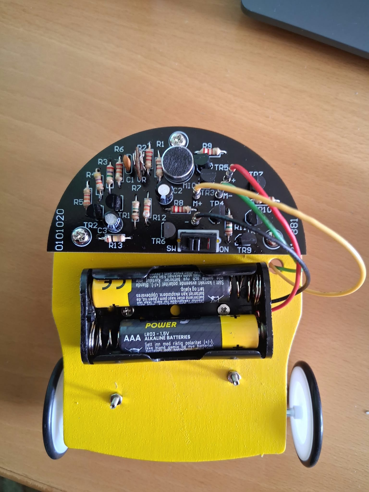
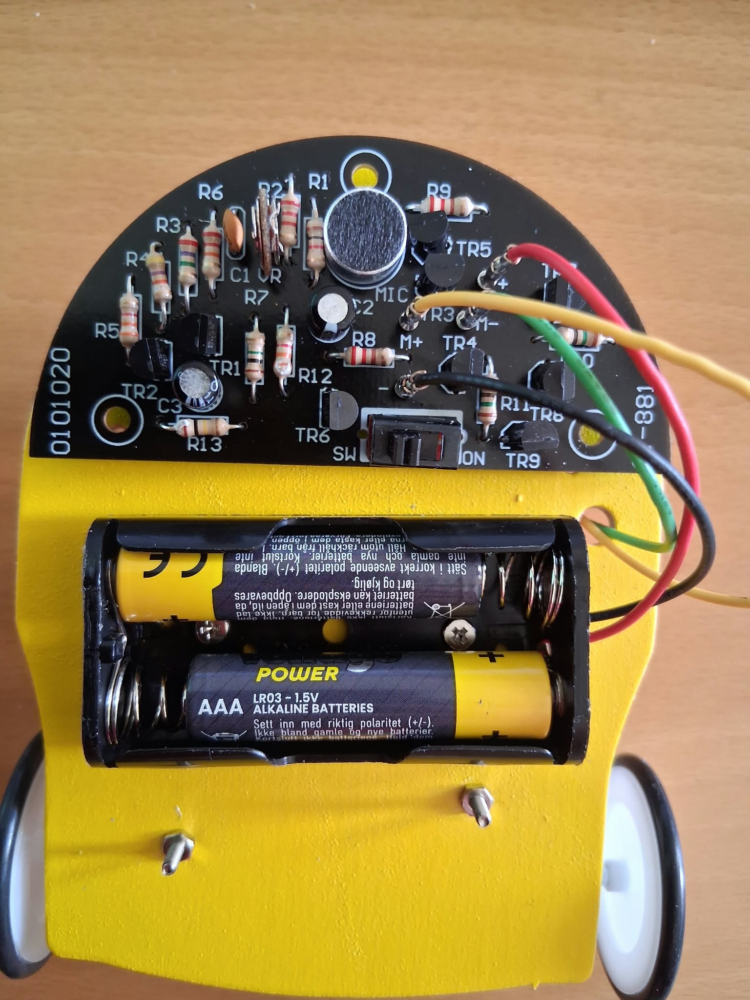
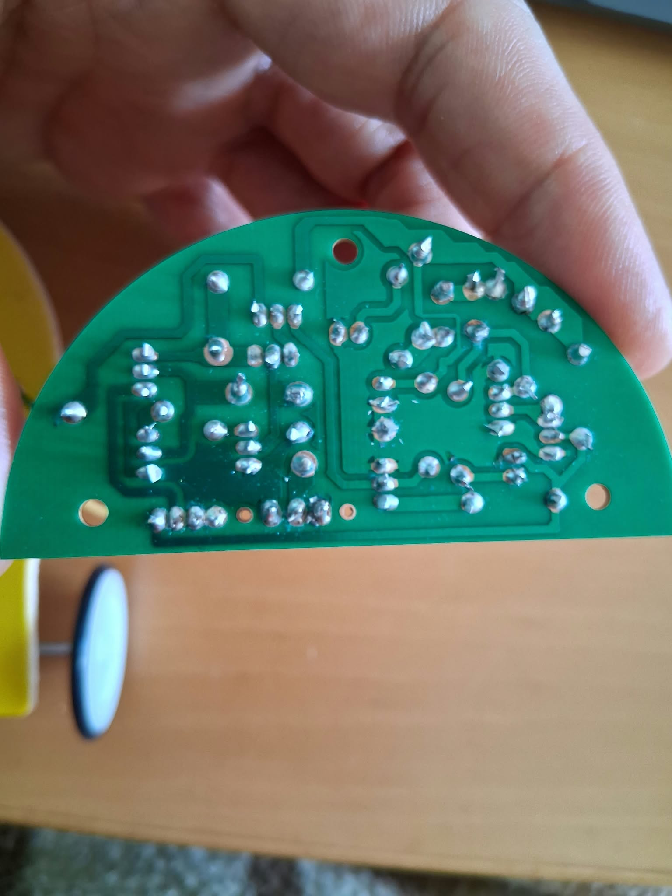
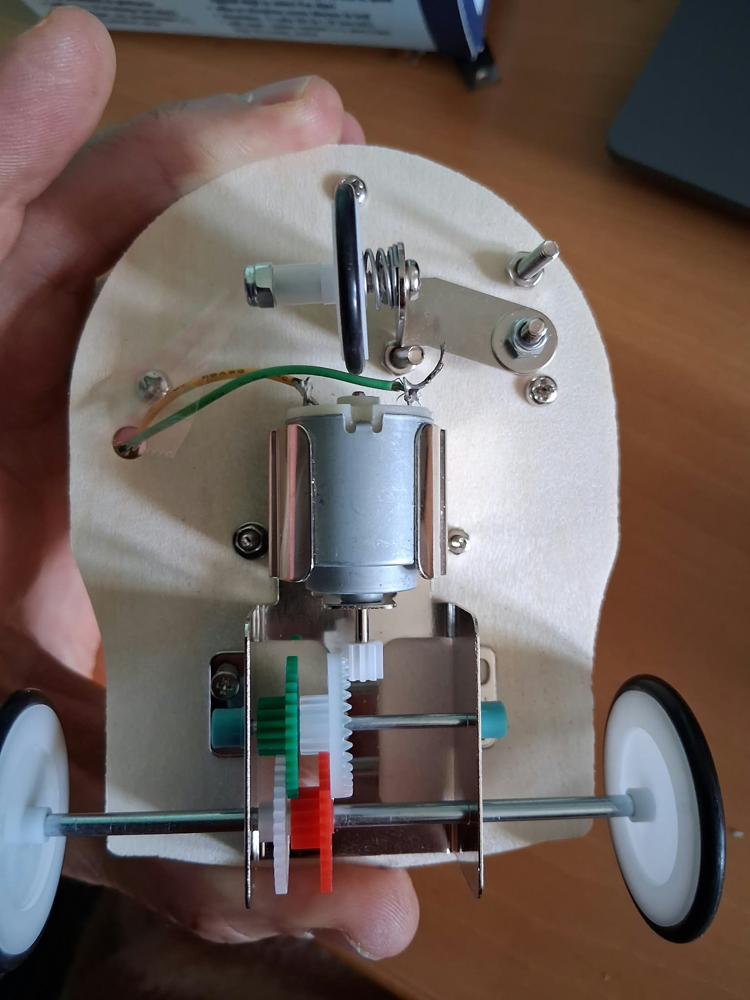

# Electronic Robot Kit

A small electronic robot kit that I assembled and soldered myself.

## About the project

I assembled the robot kit and soldered all the electronic components onto the PCB.

The completed robot was tested and is working.

## Photos

The project includes four photos showing the completed robot, the PCB and the soldering on the underside of the board.

### Completed robot

### Top of the PCB

### Soldering on the underside

### Bottom of the PCB

## Video

A 20-second video shows the completed robot starting and running.

## What I learned

* Soldering electronic components onto a PCB
* Identifying and placing components
* Following a circuit board layout
* Testing a completed electronic circuit
* Basic troubleshooting
* Connecting a motor to an electronic circuit

## Learning goal

My goal with this project is to become better at understanding electronic schematics and connecting the schematic to the physical PCB.

I want to be able to look at a circuit diagram and identify the corresponding components and connections on the actual circuit board.

## Status

**Working**

The robot has been assembled, soldered and tested successfully.
